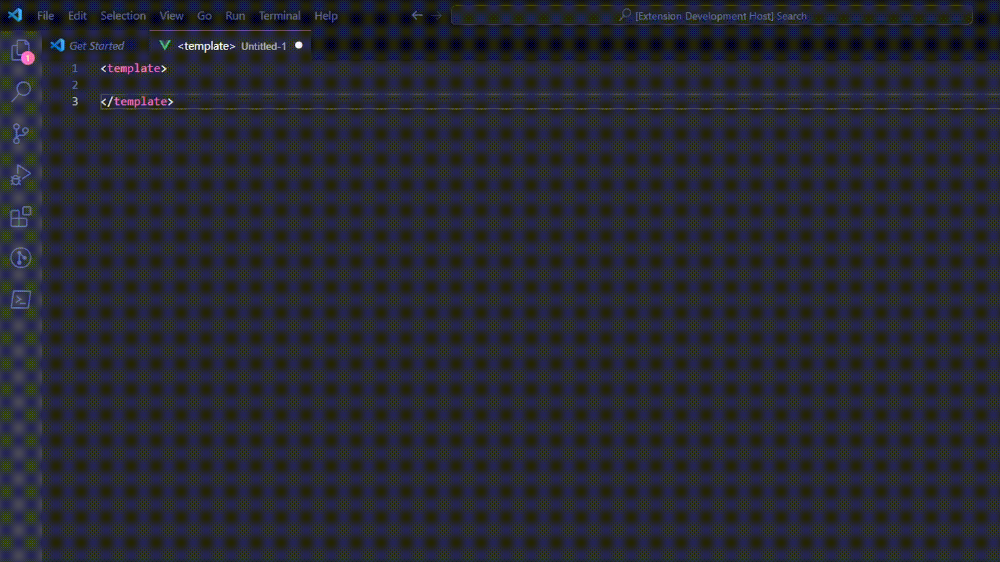

# MvSpeed

A MvSpeed surge de necessidade de acelearar o desenvolvimento com ferramentas otimizadas de criação de código

A MvSpeed conta com:

- Conversor de ViewModels C# para JavaScript/Typescript
- Gerador de formulários automático.
- Snippets de Código.

---

## Conversor de ViewModels C# ⇒ JS/Ts

A utilização consiste em:

- Selecionar a ViewModel completa no C#
- Colar a ViewModel no arquivo  **********.js********** ou ***.ts.***
- Selecionar o arquivo todo, pressionar ctrl + shift + p .
- Selecionar *******************Converter ViewModel*******************



---

## Gerador de formulário automático

o gerador tenta acelerar o processo de criação e padronização de formulários

Utilização:

1. Chamar o snippet de componente do formulário
    
    ```html
    <template>
    {{ comp }}
    <template>
    ```
    
2. Escrever o componente vue em forma de função
3. Selecionar se o formulário é flex ou grid


---

## Snippets de Código

Estão contidas nesse pacote os seguintes snippets :

- *cjs* ⇒ Gerar o js do vue - .***js***
- *cvue* ⇒ Gerar o .vue rapidamente - ****.vue****
- *midias ⇒ C*riar os midia querys para responsividade  ** - ****.vue****
- *prop* ⇒ Cria o componente js para conversão em formulário html -  *.vue*
- comp ⇒ Criar o componente do gerador de formulário - *.js*